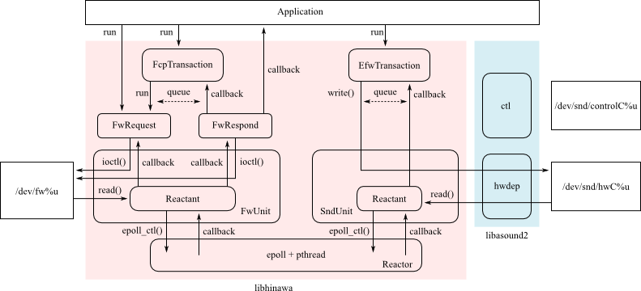

Title: Overview

This library gives some objects for abstraction to operate system resources in Linux FireWire
subsystem. This library mainly supports operations for asynchronous communication to nodes on
IEEE 1394 bus.

This library originally supported some model-specific operations for Audio and Music units on
IEEE 1394 bus, assisted by drivers in ALSA firewire stack as well, however the support has already
been migrated to [libhitaki](https://github.com/alsa-project/libhitaki) library nowadays and
obsoleted since v2.5 release.

This library expects userspace applications to use [struct@GLib.MainContext] to run event
dispatcher with [struct@GLib.Source] from [class@FwNode].

libhinawa supports gobject introspection, thus this library is available with gobject introspection
bindings of each language such as Python, Ruby and so on. When using this mechanism, please refer
to documents in each language implementation.
