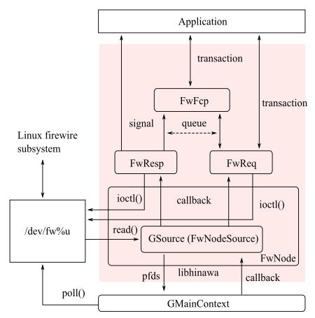

Title: Overview

This library gives some objects for abstraction to operate system resources in two Linux
subsystems; FireWire subsystem and Sound subsystem.

This library mainly supports operations for asynchronous communication to nodes on IEEE 1394 bus.
Additionally, this library supports some model-specific operations for Audio and Music units on
IEEE 1394 bus, supported by drivers in ALSA firewire stack.

This library expects userspace applications to use GMainContext to run event dispatcher with
GSource from HinawaFwNode and HinawaSndUnit. Additionally this library launches a thread for event
notifier which emits GObject signal and execute any handler on this thread so that the handler can
wait for events from the dispatcher.

libhinawa supports gobject introspection, thus this library is available with gobject introspection
bindings of each language such as Python, Ruby and so on. When using this mechanism, please refer
to documents in each language implementation.
